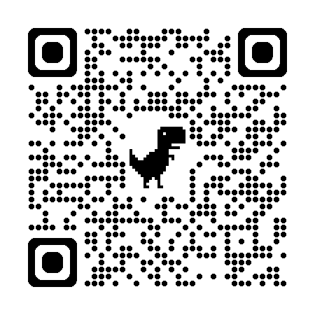

# 🎸 Kurt AR — Nirvanas WebAR Experience

> **Experiencia de Realidad Aumentada Web (WebAR) de alto rendimiento sin instalación.**  
> *Escanea el código QR objetivo con la cámara de tu smartphone para visualizar la animación interactiva de Kurt Cobain sobre el mundo real.*


<div align="center">
  <br>
  
  <p><b>📱 Escanea este código QR con tu teléfono móvil para abrir la aplicación WebAR y utilizarlo como objetivo de rastreo.</b></p>
  <br>
</div>

---

## 📖 Descripción del Proyecto

Aplicación WebAR desarrollada para el establecimiento local **"Nirvanas"**. La herramienta permite desplegar contenido interactivo mediante reconocimiento visual de imagen en tiempo real (*Image Tracking*) directamente desde el navegador web de cualquier dispositivo móvil, prescindiendo del uso de aplicaciones nativas.

Al enfocar el código QR con la cámara activada en la web, el sistema superpone una secuencia animada de ilustraciones transparentes con efecto de flotación y escala física realista en centímetros.

---

## ✨ Características Técnicas

- **Reconocimiento Objetivo Dual:** El código QR actúa simultáneamente como hiperenlace web y como patrón de rastreo AR (*Target*).
- **Pantalla de Carga Personalizada:** *Overlay* elegante con el distintivo de Nirvanas y animación fluida durante la inicialización de módulos y cámara.
- **Animación Secuencial Sincronizada:** Motor de animación en bucle con tiempos de descanso orgánicos para la postura de fumar.
- **Normalización de Matriz de Pixeles:** Ilustraciones alineadas mediante offset matemático para evitar desorden o deformación geométrica durante la alternancia de fotogramas.
- **Acceso Directo a Redes Sociales:** Botón flotante rectangular integrado con enlace directo al perfil oficial de Instagram (`@nirvanasgranada`).
- **Arquitectura Modular:** Separación limpia de componentes HTML, estilos CSS externos y scripts de control.

---

## 🛠️ Stack Tecnológico

| Módulo | Tecnología / Versión | Descripción |
|---|---|---|
| **Estructura** | HTML5 Semantic | Maquetación web y componentes de interfaz |
| **Estilos** | CSS3 (Moduled) | Arquitectura visual, animaciones Keyframes y reseteo UI |
| **Lógica** | JavaScript ES6+ | Motor de animación secuencial y manipulación de eventos DOM |
| **Renderizado 3D** | A-Frame v1.5.0 | Motor de renderizado basado en WebGL |
| **Image Tracking** | MindAR v1.2.5 | Reconocimiento visual basado en WebAssembly |

---

## 📁 Estructura del Repositorio

```text
Kurtis-AR/
│
├── index.html                        # Punto de entrada principal y escena A-Frame / MindAR
├── target.mind                       # Descriptores binarios compilados de la imagen objetivo
│
├── images/                           # Directorio central de recursos gráficos (PNGs)
│   ├── QR_Kurtis_Nirvanas.png        # Imagen objetivo QR (Target físico impreso o en pantalla)
│   ├── logo_nirvanas.png             # Logotipo oficial procesado en alta resolución PNG
│   ├── kurt1_improved_transparent.png# Fotograma 1: Reposo / Mirada fija (PNG Transparente)
│   ├── kurt2_improved_transparent.png# Fotograma 2: Transición de brazo (PNG Transparente)
│   └── kurt3_improved_transparent.png# Fotograma 3: Postura de fumar (PNG Transparente)
│
└── styles/
    └── main.css                      # Hoja de estilos principal (pantalla de carga, badge y reseteos)
```

---

## 🚀 Despliegue y Ejecución

### Acceso Directo (GitHub Pages)

La aplicación se encuentra alojada en GitHub Pages y se ejecuta desde la siguiente dirección:

👉 **[https://dianaduta.github.io/Kurtis-AR/](https://dianaduta.github.io/Kurtis-AR/)**

### Servidor de Desarrollo Local

Para ejecutar el entorno en local utilizando Python o Node.js:

```bash
# Clonar el repositorio
git clone https://github.com/DianaDuta/Kurtis-AR.git
cd Kurtis-AR

# Inicializar un servidor HTTP local (Puerto 8080)
python -m http.server 8080
```

Abrir un navegador web compatible en `http://localhost:8080`.

---

## 📄 Licencia y Créditos

Proyecto desarrollado para el establecimiento **Nirvanas Granada** ([@nirvanasgranada](https://www.instagram.com/nirvanasgranada/)).  
Todos los derechos sobre las marcas y logotipos pertenecen a sus respectivos titulares.